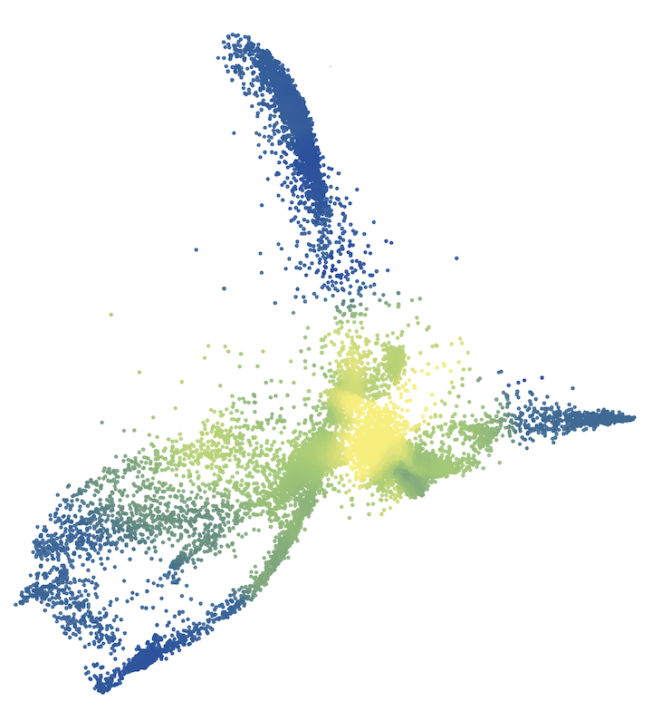

# $q$-Diffusion.jl

This software package is released as part of an ongoing project for analyzing single-cell RNA sequencing (scRNAseq) data in its full dimensionality.



## Overview

Briefly going over the available methods, we will assume you have prepared a `(genes x cells)` matrix called `data`. We usually log-normalize it before passing it to most methods. There is also a convenience mathod called `preprocess_cell_counts(data)` that returns a named tuple containing different versions of the matrix due to common preprocessing pipelines. The `*.normalized` element is simply log-normalized, sans feature selection or dimensionality reduction, like we do in our study.

### Building the Kernel

A first step is typically to build the $q$-diffused or plain Gaussian kernel. There are a number of composable options at hand. The "base" kernels are `DeformedKernel`, `GaussianKernel`, and `PossiblyDeformedKernel`, a convenience method that produces one of the earlier two kernels. It is recommended to wrap one of these in an `AdaptiveKernel` type that adjusts the base kernel's bandwidth relative to $k$-nn distances. A complete example is provided below:

```julia
kernel = AdaptiveKernel(16, # scale to the 16th nearest neighbor
  DeformedKernel(1.5f0, # set deformation parameter q=1.5
    # (kernel is less Gaussian the farther q>1 is from 1)
    data, inner_bandwidth=1.125f0), # inner bandwidth discussed below
  data, cuda_devices=[0,1,2,3], # use 4 GPUs (also discussed below)
  in_log=true) # log-transform (necessary for numerical stability)
```

### The Inner Bandwidth

The inner bandwidth controls the multiscale nature of the deformed kernel. Very approximately, it tells us what gene expressions to take seriously. A good heuristic is provided by
```julia
# pass in the same data matrix as you would to the kernel
inner_bandwidth = estimate_inner_bandwidth(data)
```

### GPU Acceleration (the `cuda_devices` function argument)
When building the kernel, and also when using many of the analysis algorithms, you would probably benefit from using a GPU to accelerate all the cell-by-cell, gene-to-gene computations that need to be performed. For that reason, we built in some fancy parallelization functionality that is accessible through the `cuda_devices`, and other similarly named, arguments.

If you wish to use one or more CUDA-enabled GPUs, the array you pass in should either have a single element or length equal to the number of threads that your Julia instance has running. This specifies the CUDA device ID(s) that each thread should use. If you don't pass a value to the `cuda_devices` argument, it will delegate to a CPU-bound method.


## Some Ways to Use the Kernel

### Nonnegative Matrix Factorization (NMF)

```julia
# bandwidth is normally set to 1.0 when using an adaptive kernel
factors = par_estimate_nmf(kernel, data, bandwidth,
  rank=16, # number of gene expression programs (GEPs)
  regularizations=[0f0, 1f0], # how much to regularize by kernel
  # ^ multiple entries makes it re-estimate multiple times
  n_iterations=512,
  cuda_devices=[0],
  seed=1337) # random seed
```

### $q$-Diffused [PHATE](https://www.nature.com/articles/s41587-019-0336-3)

```julia
embedding = leave_it_to_phate(kernel, data, bandwidth,
  n_landmarks=-1, # a positive integer invokes the landmark approx
  n_bases=100, # how many eigenvectors / basis vectors to compute
  n_manifold_dims=2, # embedding dimensionality
  tree_leaf_size=0, # this and the below are for CPU mode,
  n_kernel_neighbors=0, # if you want to use a spatial tree structure
  cuda_devices=[0])
```


### Comprehensive documentation to come shortly!